# Sentiment Analysis of Movie Reviews
### A Comparative Study of Machine Learning Approaches with Multiple Feature Representations

**Course:** CSE3246 – Natural Language Processing  
**Topic:** Movie Review Sentiment Analysis  

---

## 📋 Table of Contents
- [Overview](#overview)
- [Key Contributions](#key-contributions)
- [Project Structure](#project-structure)
- [Setup & Installation](#setup--installation)
- [Pipeline Overview](#pipeline-overview)
- [Dataset](#dataset)
- [Feature Extraction](#feature-extraction)
- [Models](#models)
- [Results](#results)
- [Visualizations](#visualizations)
- [How to Run](#how-to-run)

---

## Overview

This project performs **sentiment analysis on IMDb movie reviews** — classifying 50,000 real reviews as **positive** or **negative** using three machine learning algorithms across four feature representations, yielding **12 distinct experiments**. The project goes beyond standard comparisons by introducing hybrid feature fusion, misclassification error analysis, and cross-representation stability analysis.

### Problem Statement
Movie reviews on platforms like IMDb contain rich subjective opinions expressed in natural language. Automatically determining the sentiment polarity (positive or negative) of these reviews is a fundamental NLP classification task with applications in recommendation systems, market research, and customer feedback analysis. This project investigates which combinations of text representation and machine learning algorithms yield the most accurate and stable sentiment classification.

---

## Key Contributions

### 1. Hybrid Feature Fusion (TF-IDF + Sentiment Lexicon Scores)
Beyond comparing BoW, TF-IDF, and Word2Vec in isolation, we build a **hybrid feature vector** that appends lexicon-based sentiment scores (VADER compound score, TextBlob polarity & subjectivity) to TF-IDF vectors. This tests whether combining statistical text features with domain-aware sentiment signals improves classification — and our results confirm it does, yielding the **best accuracy of 89.52%**.

### 2. Misclassification Error Analysis with Linguistic Patterns
After evaluation, we perform a **systematic error analysis** on misclassified reviews. We analyze *why* models fail by examining:
- Average review length of misclassified vs correctly classified reviews
- Presence of negation words ("not", "never", "hardly", etc.)
- Mixed-sentiment patterns

Results show misclassified reviews contain significantly **more negation words**, suggesting negation handling is a key area for improvement.

### 3. Cross-Representation Stability Analysis via MCC
We use **Matthews Correlation Coefficient (MCC)** — an unbiased metric — to evaluate which model–feature combinations are most *stable*. A **heatmap matrix** (3 models × 4 feature types) reveals that Logistic Regression with Hybrid features is the most stable configuration (MCC: 0.7904).

---

## Project Structure

```
nlp_project/
├── data/                          # Dataset storage
│   ├── imdb_reviews.csv           # Raw 50K reviews
│   └── cleaned_reviews.csv        # Preprocessed reviews
├── outputs/
│   ├── plots/                     # 25 generated visualizations
│   │   ├── class_distribution.png
│   │   ├── review_length_distribution.png
│   │   ├── review_length_boxplot.png
│   │   ├── word_clouds.png
│   │   ├── top_words.png
│   │   ├── cm_*.png               # 12 confusion matrices
│   │   ├── learning_curve_*.png   # 2 learning curves
│   │   ├── error_analysis_*.png   # 3 error analysis plots
│   │   ├── comparative_metrics.png
│   │   ├── per_metric_comparison.png
│   │   └── mcc_heatmap.png
│   └── experimental_results.csv   # Full metrics table
├── src/
│   ├── __init__.py
│   ├── data_loader.py             # Dataset download via HuggingFace
│   ├── preprocessing.py           # Text cleaning pipeline
│   ├── eda.py                     # Exploratory data analysis
│   ├── feature_extraction.py      # BoW, TF-IDF, Word2Vec, Hybrid
│   ├── models.py                  # LR, SVM, Random Forest
│   ├── evaluation.py              # All metrics + visualizations
│   └── utils.py                   # Helper functions
├── main.py                        # Full pipeline runner
├── requirements.txt
└── README.md
```

---

## Setup & Installation

### Prerequisites
- Python 3.8+
- pip

### Install Dependencies
```bash
pip install -r requirements.txt
```

**Dependencies:** numpy, pandas, matplotlib, seaborn, scikit-learn, nltk, textblob, vaderSentiment, gensim, wordcloud, tabulate, datasets

---

## Pipeline Overview

The pipeline executes the following steps automatically:

```
1. Load Dataset (IMDb 50K via HuggingFace)
        ↓
2. Preprocess Text (HTML removal → lowercase → tokenize → stopwords → lemmatize)
        ↓
3. Exploratory Data Analysis (distributions, word clouds, top words)
        ↓
4. Feature Extraction (BoW, TF-IDF, Word2Vec, Hybrid)
        ↓
5. Model Training (Logistic Regression, SVM, Random Forest × 4 features)
        ↓
6. Evaluation (13+ metrics per experiment, confusion matrices)
        ↓
7. Error Analysis & Visualization (MCC heatmap, learning curves, comparative charts)
```

---

## Dataset

### IMDb Movie Review Dataset

| Property | Value |
|----------|-------|
| **Source** | IMDb via HuggingFace `datasets` library |
| **Total Reviews** | 50,000 |
| **Positive Reviews** | 25,000 (50%) |
| **Negative Reviews** | 25,000 (50%) |
| **Split** | 80% Train / 20% Test (stratified) |
| **Format** | Raw English text reviews |
| **Class Balance** | Perfectly balanced |

### Dataset Visualizations

**Class Distribution:**
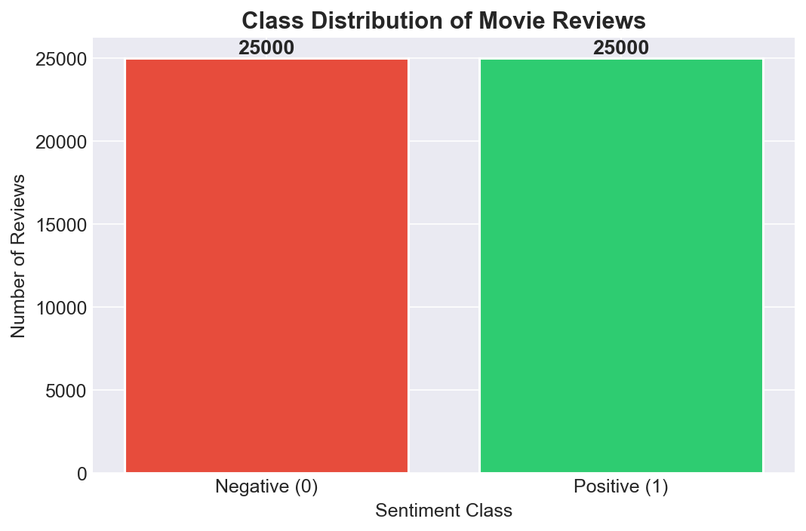

**Review Length Distribution:**
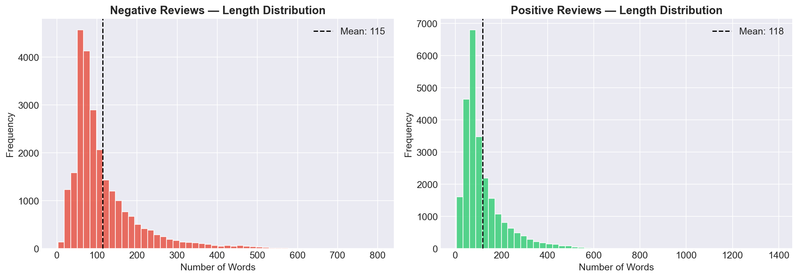

**Word Clouds (Positive vs Negative):**
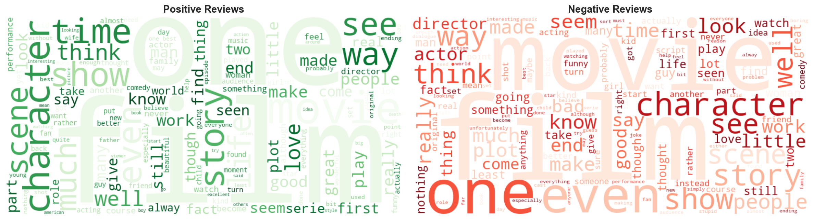

**Top 20 Most Frequent Words per Class:**
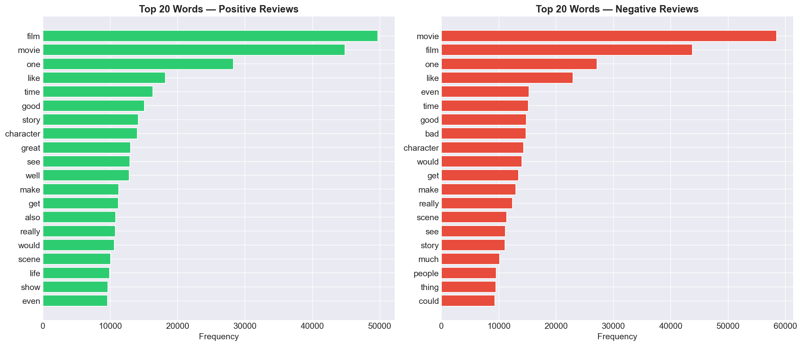

**Review Length Box Plot:**
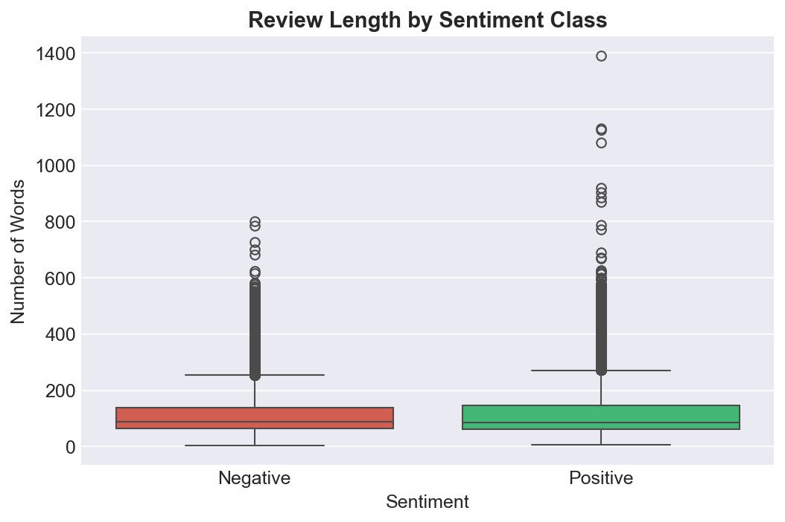

---

## Feature Extraction

### 1. Bag of Words (BoW)
Converts text into a fixed-length vector based on word frequency counts using `CountVectorizer` with a vocabulary of 10,000 features.

### 2. TF-IDF (Term Frequency–Inverse Document Frequency)
Weighs words by their importance in a document relative to the corpus using `TfidfVectorizer` with sublinear TF scaling and 10,000 features.

### 3. Word2Vec (Word Embeddings)
Trains a Word2Vec model (100-dimensional, window=5, min_count=2, 10 epochs) on the corpus using Gensim, then computes document vectors by averaging word embeddings.

### 4. Hybrid (TF-IDF + Sentiment Lexicon) — *Novel*
Combines TF-IDF features with 6 sentiment lexicon features:
- **VADER:** compound, positive, negative, neutral scores
- **TextBlob:** polarity, subjectivity scores

This creates a feature vector of 10,006 dimensions.

---

## Models

### 1. Logistic Regression
- **Penalty:** L2 regularization
- **C (Regularization strength):** 1.0
- **Solver:** liblinear
- **Max Iterations:** 1000

### 2. Support Vector Machine (Linear SVM)
- **Kernel:** Linear (via LinearSVC)
- **C (Regularization strength):** 1.0
- **Max Iterations:** 2000

### 3. Random Forest Classifier
- **N Estimators:** 200 trees
- **Max Depth:** 50
- **Min Samples Split:** 5
- **Min Samples Leaf:** 2

---

## Results

### Complete Experimental Results

| Model | Features | Accuracy | Precision | Recall | F1-Score | MCC | Sensitivity | Specificity | FPR | FNR | NPV | FDR |
|-------|----------|----------|-----------|--------|----------|-----|-------------|-------------|-----|-----|-----|-----|
| **LR** | **Hybrid** | **0.8952** | **0.8910** | **0.9006** | **0.8958** | **0.7904** | 0.9006 | 0.8898 | 0.1102 | 0.0994 | 0.8995 | 0.1090 |
| LR | TF-IDF | 0.8949 | 0.8886 | 0.9030 | 0.8957 | 0.7899 | 0.9030 | 0.8868 | 0.1132 | 0.0970 | 0.9014 | 0.1114 |
| SVM | Hybrid | 0.8914 | 0.8888 | 0.8948 | 0.8918 | 0.7828 | 0.8948 | 0.8880 | 0.1120 | 0.1052 | 0.8941 | 0.1112 |
| SVM | TF-IDF | 0.8891 | 0.8875 | 0.8912 | 0.8893 | 0.7782 | 0.8912 | 0.8870 | 0.1130 | 0.1088 | 0.8907 | 0.1125 |
| SVM | Word2Vec | 0.8709 | 0.8663 | 0.8772 | 0.8717 | 0.7419 | 0.8772 | 0.8646 | 0.1354 | 0.1228 | 0.8756 | 0.1337 |
| LR | Word2Vec | 0.8705 | 0.8668 | 0.8756 | 0.8712 | 0.7410 | 0.8756 | 0.8654 | 0.1346 | 0.1244 | 0.8743 | 0.1332 |
| LR | BoW | 0.8709 | 0.8693 | 0.8730 | 0.8712 | 0.7418 | 0.8730 | 0.8688 | 0.1312 | 0.1270 | 0.8725 | 0.1307 |
| RF | BoW | 0.8552 | 0.8402 | 0.8772 | 0.8583 | 0.7111 | 0.8772 | 0.8332 | 0.1668 | 0.1228 | 0.8715 | 0.1598 |
| RF | TF-IDF | 0.8521 | 0.8407 | 0.8688 | 0.8545 | 0.7046 | 0.8688 | 0.8354 | 0.1646 | 0.1312 | 0.8643 | 0.1593 |
| RF | Word2Vec | 0.8518 | 0.8354 | 0.8762 | 0.8553 | 0.7044 | 0.8762 | 0.8274 | 0.1726 | 0.1238 | 0.8698 | 0.1646 |
| SVM | BoW | 0.8486 | 0.8520 | 0.8438 | 0.8479 | 0.6972 | 0.8438 | 0.8534 | 0.1466 | 0.1562 | 0.8453 | 0.1480 |
| RF | Hybrid | 0.8403 | 0.8358 | 0.8470 | 0.8414 | 0.6807 | 0.8470 | 0.8336 | 0.1664 | 0.1530 | 0.8449 | 0.1642 |

> **Best Model:** Logistic Regression + Hybrid Features → **89.52% Accuracy, F1: 0.8958, MCC: 0.7904**

### Key Findings
1. **Hybrid features outperform standalone TF-IDF** — confirming that adding lexicon-based sentiment scores provides complementary signal
2. **Logistic Regression is the most consistent model** — highest MCC across all feature types
3. **TF-IDF and Hybrid representations dominate** — both significantly outperform BoW and Word2Vec
4. **Random Forest underperforms on text classification** — tree-based methods struggle with high-dimensional sparse features
5. **Misclassified reviews contain more negation words** — suggesting negation handling is a key improvement area

### Comparative Performance
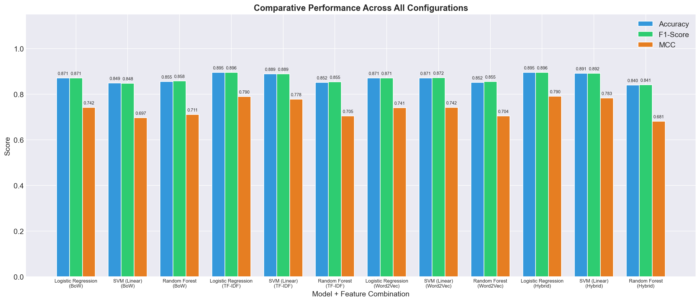

### Per-Metric Comparison by Feature Type
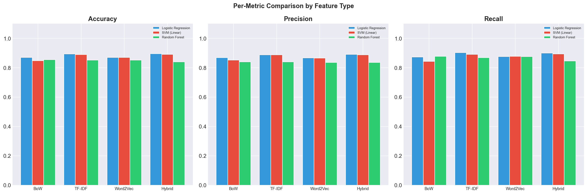

### MCC Cross-Representation Stability Heatmap
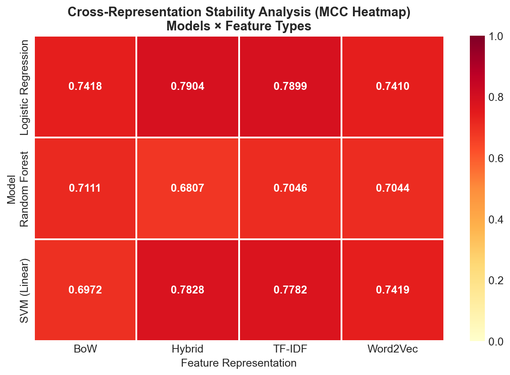

### Confusion Matrices (Selected)
| Logistic Regression + Hybrid | SVM + TF-IDF | Random Forest + BoW |
|:---:|:---:|:---:|
| 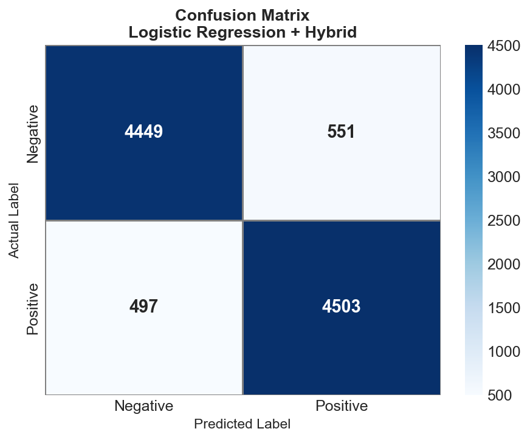 |  | 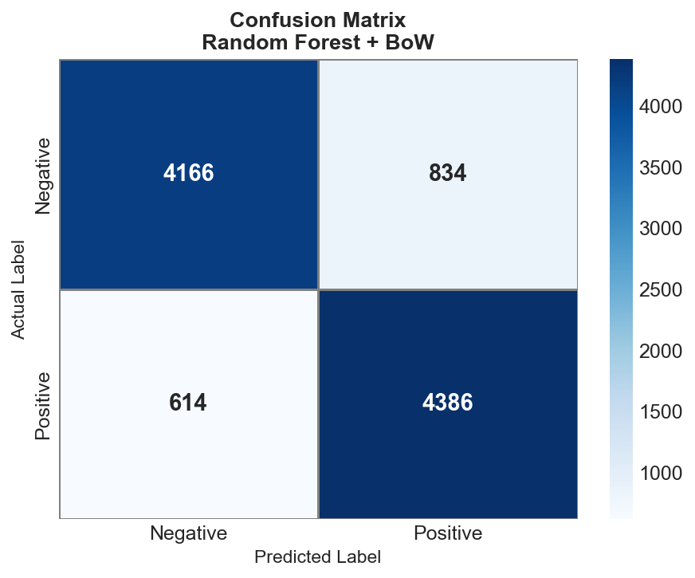 |

### Learning Curves
| Logistic Regression + TF-IDF | Random Forest + BoW |
|:---:|:---:|
| 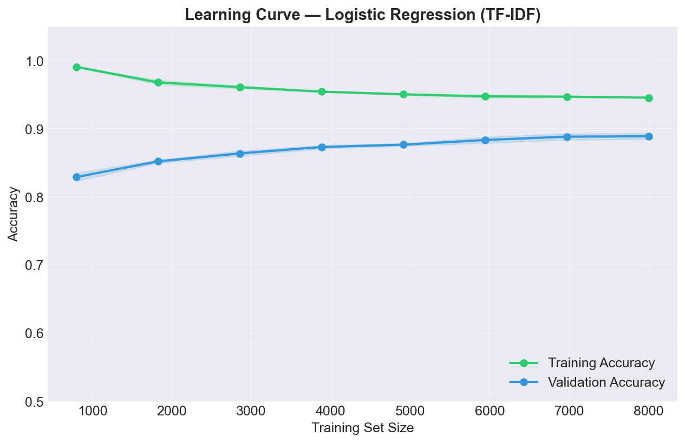 | 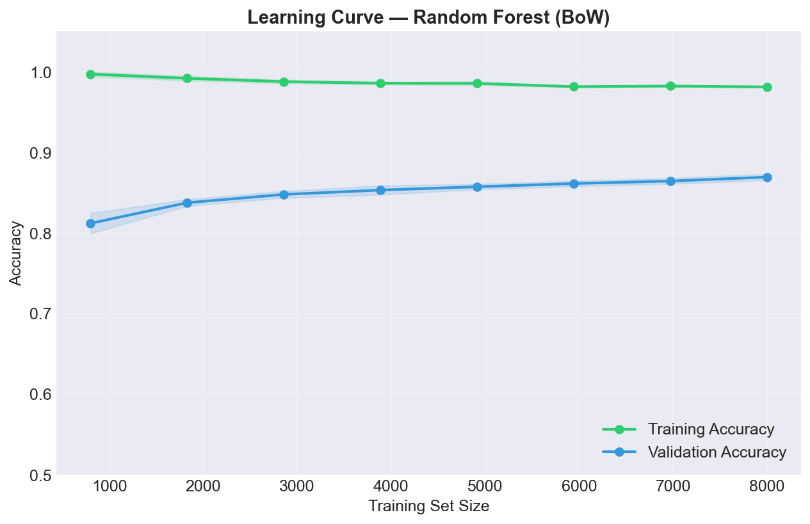 |

### Error Analysis
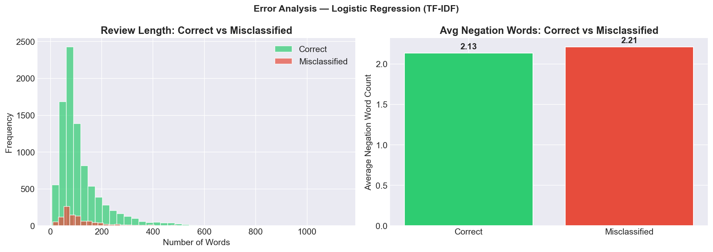

---

## How to Run

```bash
# Install dependencies
pip install -r requirements.txt

# Run the full pipeline
python main.py
```

The pipeline will:
1. Download the IMDb dataset (50K reviews) via HuggingFace
2. Preprocess all reviews (tokenization, stopword removal, lemmatization)
3. Generate EDA visualizations (word clouds, distributions)
4. Extract 4 types of features (BoW, TF-IDF, Word2Vec, Hybrid)
5. Train 3 models × 4 feature types = 12 experiments
6. Compute all evaluation metrics and generate 25 plots
7. Save results to `outputs/`

---

## Tools & Libraries Used
- **Python 3.x** — Core programming language
- **NLTK** — Tokenization, stopword removal, lemmatization
- **TextBlob** — Sentiment polarity and subjectivity analysis
- **VADER (vaderSentiment)** — Rule-based sentiment analysis
- **Scikit-learn** — ML models, vectorizers, evaluation metrics
- **Gensim** — Word2Vec word embeddings
- **Matplotlib & Seaborn** — Data visualization
- **WordCloud** — Word cloud generation
- **HuggingFace Datasets** — Dataset download

---

## References
1. Maas, A. L., et al. (2011). *Learning Word Vectors for Sentiment Analysis.* ACL.
2. Bird, S., Klein, E., & Loper, E. (2009). *Natural Language Processing with Python.* O'Reilly.
3. Hutto, C. J., & Gilbert, E. (2014). *VADER: A Parsimonious Rule-based Model for Sentiment Analysis of Social Media Text.* ICWSM.
4. Mikolov, T., et al. (2013). *Efficient Estimation of Word Representations in Vector Space.* arXiv:1301.3781.
5. Pedregosa, F., et al. (2011). *Scikit-learn: Machine Learning in Python.* JMLR.
6. Han, J., & Kamber, M. (2012). *Data Mining: Concepts and Techniques.* Morgan Kaufmann.
7. Jurman, G., Riccadonna, S., & Furlanello, C. (2012). *A Comparison of MCC and CEN Error Measures in Multi-Class Prediction.* PLOS ONE.
