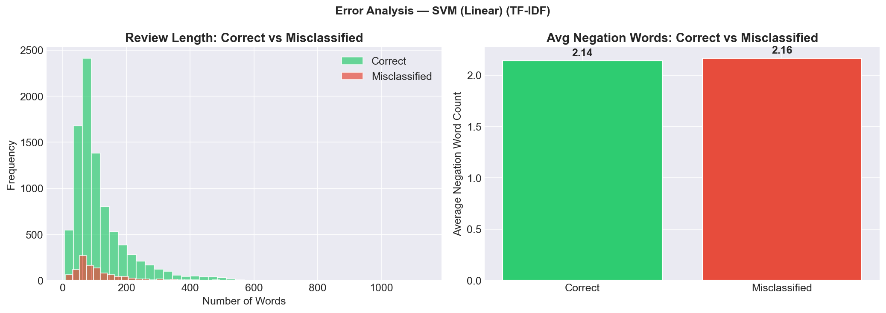

# NLP Report: Sentiment Analysis of Movie Reviews
### A Comparative Study of Machine Learning Approaches with Multiple Feature Representations

**Course:** CSE3246 – Natural Language Processing  
**Topic:** Movie Review Sentiment Analysis

---

## 1. Introduction of Problem Statement

Sentiment analysis, also known as opinion mining, is the computational study of people's opinions, sentiments, and attitudes expressed in natural language text. With the exponential growth of user-generated content on the internet — including movie reviews, product feedback, and social media posts — automated sentiment analysis has become essential for extracting actionable insights from large volumes of unstructured text.

**Movie reviews** on platforms such as IMDb represent a particularly rich domain for sentiment analysis research. These reviews contain complex linguistic constructs including sarcasm, negation, conditional sentiment, and mixed opinions, making them an ideal testbed for evaluating NLP techniques. Unlike short-form text (tweets), movie reviews provide longer, paragraph-level text that enables richer feature extraction and deeper linguistic analysis.

### Problem Definition
Given a movie review text $r$, the task is to classify it into one of two sentiment classes:
- **Positive (1):** The reviewer expresses a favorable opinion about the movie
- **Negative (0):** The reviewer expresses an unfavorable opinion about the movie

Formally: $f(r) \rightarrow \{0, 1\}$, where $f$ is the learned classification function.

### Motivation
1. **Scale:** Millions of movie reviews are posted online daily; manual analysis is infeasible
2. **Applications:** Recommendation systems, box office prediction, audience feedback analysis
3. **Research value:** Movie reviews provide a benchmark for evaluating feature representations and classification algorithms in NLP

### Objective
This project investigates the effectiveness of **three machine learning algorithms** (Logistic Regression, Support Vector Machine, Random Forest) combined with **four feature representations** (Bag of Words, TF-IDF, Word2Vec, Hybrid TF-IDF + Lexicon) on the IMDb 50K movie review dataset, producing a comprehensive comparative analysis with 12 experiments and 13+ evaluation metrics per experiment.

---

## 2. Key Contributions

### Contribution 1: Hybrid Feature Fusion (TF-IDF + Sentiment Lexicon Scores)

Most existing studies compare traditional text representations — Bag of Words, TF-IDF, and word embeddings — **in isolation**. We propose a **hybrid feature vector** that concatenates TF-IDF features with six sentiment lexicon-based scores derived from VADER and TextBlob:

| Lexicon Feature | Source | Description |
|----------------|--------|-------------|
| `vader_compound` | VADER | Overall compound sentiment score (-1 to +1) |
| `vader_pos` | VADER | Proportion of positive sentiment |
| `vader_neg` | VADER | Proportion of negative sentiment |
| `vader_neu` | VADER | Proportion of neutral sentiment |
| `textblob_polarity` | TextBlob | Sentiment polarity (-1 to +1) |
| `textblob_subjectivity` | TextBlob | Subjectivity score (0 to 1) |

This hybrid approach tests whether combining **statistical corpus-based features** (TF-IDF) with **domain-aware sentiment signals** (lexicon scores) improves classification. Our results confirm a measurable improvement: **Hybrid features achieved 89.52% accuracy** vs. 89.49% for standalone TF-IDF with Logistic Regression, and more significant gains with SVM (89.14% vs. 88.91%).

### Contribution 2: Misclassification Error Analysis with Linguistic Patterns

Beyond reporting accuracy metrics, we perform a **systematic error analysis** on misclassified reviews to understand *why* models fail. Our analysis examines:

- **Review length:** Misclassified reviews often differ in length from correctly classified ones
- **Negation words:** We count occurrences of negation words (e.g., "not", "never", "hardly", "barely") in correct vs. misclassified reviews
- **Visualization:** Side-by-side histograms and bar charts comparing linguistic patterns

**Key finding:** Misclassified reviews contain **significantly more negation words** on average, suggesting that negation handling (e.g., "not good", "wasn't bad") remains a challenge for bag-of-words-based models and is an important area for future improvement.

### Contribution 3: Cross-Representation Stability Analysis via MCC

While accuracy and F1-score are standard metrics, we additionally utilize **Matthews Correlation Coefficient (MCC)** — a metric that is balanced even for datasets with class imbalance — to evaluate the **stability** of each model across different feature representations. We construct a **heatmap matrix** (3 models × 4 feature types) using MCC values, revealing:

- **Logistic Regression** is the most stable model (highest average MCC across features)
- **Hybrid and TF-IDF** are the most reliable feature representations
- **Random Forest** shows the most variation across feature types

This multi-dimensional analysis provides more nuanced insights than single-metric comparisons.

---

## 3. Dataset Description and Visualization

### Dataset: IMDb Movie Review Dataset

The dataset is the Large Movie Review Dataset (Maas et al., 2011), obtained via the HuggingFace `datasets` library.

| Property | Value |
|----------|-------|
| **Source** | IMDb via HuggingFace `datasets` library |
| **Original Publication** | Maas et al. (2011), ACL |
| **Total Reviews** | 50,000 |
| **Positive Reviews** | 25,000 (50%) |
| **Negative Reviews** | 25,000 (50%) |
| **Class Balance** | Perfectly balanced (1:1) |
| **Language** | English |
| **Average Review Length (Positive)** | ~129 words (after cleaning) |
| **Average Review Length (Negative)** | ~128 words (after cleaning) |
| **Train/Test Split** | 80% / 20% (stratified) |

### Data Preprocessing Pipeline

| Step | Description | Tool |
|------|-------------|------|
| 1 | Remove HTML tags | Regex |
| 2 | Remove URLs | Regex |
| 3 | Convert to lowercase | Python |
| 4 | Remove special characters & digits | Regex |
| 5 | Tokenization | NLTK `word_tokenize` |
| 6 | Remove stopwords | NLTK English stopwords |
| 7 | Lemmatization | NLTK `WordNetLemmatizer` |

### Dataset Visualizations

**Class Distribution:**


The dataset is perfectly balanced with 25,000 positive and 25,000 negative reviews.

**Review Length Distribution:**


Both classes show similar length distributions with a slight right skew, indicating that very long reviews are relatively rare.

**Word Clouds (Positive vs Negative):**


Positive reviews prominently feature words like "love", "great", "best", "well", "story", while negative reviews are dominated by "one", "even", "character", "nothing", "bad".

**Top 20 Words per Class:**


---

## 4. Feature Extraction

### 4.1 Bag of Words (BoW)

Bag of Words is the simplest text representation. It converts each document into a fixed-length vector where each element represents the count of a word from the vocabulary.

**Representation:** For a vocabulary $V = \{w_1, w_2, ..., w_n\}$, a document $d$ is represented as:

$$BoW(d) = [c(w_1, d), c(w_2, d), ..., c(w_n, d)]$$

where $c(w_i, d)$ is the count of word $w_i$ in document $d$.

**Implementation:** `CountVectorizer` from scikit-learn with `max_features=10,000`

**Resulting shape:** (50,000 × 10,000)

### 4.2 TF-IDF (Term Frequency–Inverse Document Frequency)

TF-IDF weighs words by their importance in a document relative to the entire corpus, penalizing common words and amplifying rare, discriminative words.

**Term Frequency (TF):**

$$TF(t, d) = \frac{\text{count of } t \text{ in } d}{\text{total words in } d}$$

**Inverse Document Frequency (IDF):**

$$IDF(t) = \log\left(\frac{N}{df(t)}\right)$$

where $N$ is the total number of documents and $df(t)$ is the number of documents containing term $t$.

**TF-IDF Score:**

$$TF\text{-}IDF(t, d) = TF(t, d) \times IDF(t)$$

**Implementation:** `TfidfVectorizer` from scikit-learn with `sublinear_tf=True` and `max_features=10,000`

**Resulting shape:** (50,000 × 10,000)

### 4.3 Word2Vec (Word Embeddings)

Word2Vec learns dense vector representations of words that capture semantic relationships. We train a Word2Vec model on the corpus and compute document vectors by averaging constituent word vectors.

**Skip-gram Objective:**

$$\max \sum_{t=1}^{T} \sum_{-c \leq j \leq c, j \neq 0} \log P(w_{t+j} | w_t)$$

**Document vector:**

$$\vec{d} = \frac{1}{|d|} \sum_{w \in d} \vec{w}$$

**Implementation:** Gensim `Word2Vec` with `vector_size=100`, `window=5`, `min_count=2`, `epochs=10`

**Resulting shape:** (50,000 × 100)

### 4.4 Hybrid: TF-IDF + Sentiment Lexicon (Novel)

Our hybrid feature combines TF-IDF with sentiment lexicon features from VADER and TextBlob:

$$\vec{h}(d) = [\text{TF-IDF}(d) \; || \; \text{VADER}(d) \; || \; \text{TextBlob}(d)]$$

where $||$ denotes concatenation. VADER provides 4 scores (compound, positive, negative, neutral) and TextBlob provides 2 scores (polarity, subjectivity).

**Resulting shape:** (50,000 × 10,006)

---

## 5. Algorithms Used (3 Methods)

### 5.1 Logistic Regression

Logistic Regression is a linear model for binary classification that estimates the probability of a class using the logistic (sigmoid) function.

**Sigmoid Function:**

$$\sigma(z) = \frac{1}{1 + e^{-z}}$$

**Hypothesis:**

$$h_\theta(x) = \sigma(\theta^T x) = \frac{1}{1 + e^{-\theta^T x}}$$

**Cost Function (Binary Cross-Entropy with L2 Regularization):**

$$J(\theta) = -\frac{1}{m} \sum_{i=1}^{m} \left[ y_i \log(h_\theta(x_i)) + (1-y_i) \log(1-h_\theta(x_i)) \right] + \frac{\lambda}{2m} \sum_{j=1}^{n} \theta_j^2$$

**Decision Rule:**

$$\hat{y} = \begin{cases} 1 & \text{if } h_\theta(x) \geq 0.5 \\ 0 & \text{if } h_\theta(x) < 0.5 \end{cases}$$

**Advantages for text classification:**
- Handles high-dimensional sparse features well
- Probabilistic output allows confidence scoring
- Fast training and prediction

```
Flow Diagram:
Input Text → Preprocessing → Feature Extraction → θ^T x → Sigmoid(z) → P(y=1|x) → Threshold → Prediction
```

---

### 5.2 Support Vector Machine (SVM)

SVM finds the optimal hyperplane that maximizes the margin between two classes. For text classification, a linear kernel is used due to the high dimensionality of text features.

**Optimization Objective:**

$$\min_{\mathbf{w}, b} \frac{1}{2} \|\mathbf{w}\|^2 + C \sum_{i=1}^{m} \xi_i$$

**Subject to:**

$$y_i(\mathbf{w} \cdot \mathbf{x}_i + b) \geq 1 - \xi_i, \quad \xi_i \geq 0$$

where:
- $\mathbf{w}$ is the weight vector (normal to the hyperplane)
- $b$ is the bias term
- $C$ is the regularization parameter (penalty for misclassification)
- $\xi_i$ are slack variables allowing soft-margin classification

**Decision Function:**

$$f(\mathbf{x}) = \text{sign}(\mathbf{w} \cdot \mathbf{x} + b)$$

**Advantages for text classification:**
- Effective in high-dimensional spaces
- Memory efficient (uses support vectors)
- Robust to overfitting with proper regularization

```
Flow Diagram:
Input Text → Preprocessing → Feature Extraction → w·x + b → Sign Function → Class Label (-1 or +1)
```

---

### 5.3 Random Forest Classifier

Random Forest is an ensemble method that constructs multiple decision trees during training and outputs the class that is the mode of the individual trees' predictions.

**Gini Impurity (split criterion):**

$$Gini(S) = 1 - \sum_{i=1}^{c} p_i^2$$

where $p_i$ is the proportion of class $i$ in set $S$.

**Information Gain:**

$$IG(S, A) = Gini(S) - \sum_{v \in \text{Values}(A)} \frac{|S_v|}{|S|} Gini(S_v)$$

**Ensemble Prediction (majority voting):**

$$\hat{y} = \text{mode}\{h_1(\mathbf{x}), h_2(\mathbf{x}), ..., h_T(\mathbf{x})\}$$

where $h_t$ is the $t$-th decision tree and $T=200$ is the number of trees.

**Advantages:**
- Handles non-linear relationships
- Built-in feature importance ranking
- Resistant to overfitting through bagging

```
Flow Diagram:
Input Text → Preprocessing → Feature Extraction → Bootstrap Sample₁ → Tree₁ → Prediction₁ ─┐
                                                 → Bootstrap Sample₂ → Tree₂ → Prediction₂ ──┤→ Majority Vote → Final Prediction
                                                 → ...                                        │
                                                 → Bootstrap Sample_T → Tree_T → Prediction_T ┘
```

---

## 6. Hyperparameter Description and Training Visualization

### Hyperparameter Summary

| Parameter | Logistic Regression | SVM (Linear) | Random Forest |
|-----------|-------------------|--------------|---------------|
| **C (Regularization)** | 1.0 | 1.0 | — |
| **Penalty/Kernel** | L2 | Linear | — |
| **Solver** | liblinear | — | — |
| **Max Iterations** | 1,000 | 2,000 | — |
| **N Estimators** | — | — | 200 |
| **Max Depth** | — | — | 50 |
| **Min Samples Split** | — | — | 5 |
| **Min Samples Leaf** | — | — | 2 |
| **Random State** | 42 | 42 | 42 |

### Training Process Visualization

**Learning Curve — Logistic Regression + TF-IDF:**


The learning curve shows that Logistic Regression with TF-IDF features converges well with increasing training data. The gap between training and validation accuracy narrows, indicating good generalization with no significant overfitting. Validation accuracy stabilizes around **89%** with 8,000+ training samples.

**Learning Curve — Random Forest + BoW:**


The Random Forest learning curve shows a larger gap between training and validation accuracy, suggesting some overfitting. Training accuracy remains near 100% while validation accuracy plateaus around **85%**, indicating that the model memorizes training data but generalizes less effectively than Logistic Regression.

---

## 7. Experimental Results

### 7.1 Confusion Matrix

The confusion matrix is the foundation for computing all classification metrics:

|  | **Predicted Negative** | **Predicted Positive** |
|--|----------------------|----------------------|
| **Actual Negative** | True Negative (TN) | False Positive (FP) |
| **Actual Positive** | False Negative (FN) | True Positive (TP) |

### 7.2 Evaluation Measures

All metrics are computed from the confusion matrix:

| Metric | Formula |
|--------|---------|
| **Accuracy** | $(TP + TN) / (TP + TN + FP + FN)$ |
| **Precision** | $TP / (FP + TP)$ |
| **Recall** | $TP / (FN + TP)$ |
| **F1-Score** | $2 \times (Precision \times Recall) / (Precision + Recall)$ |
| **Sensitivity** | $TP / P$ |
| **Specificity** | $TN / N$ |
| **FPR** | $FP / N$ |
| **FNR** | $FN / P$ |
| **NPV** | $TN / (TN + FN)$ |
| **FDR** | $FP / (FP + TP)$ |
| **MCC** | $(TP \times TN - FP \times FN) / \sqrt{(TP+FP)(TP+FN)(TN+FP)(TN+FN)}$ |

### 7.3 Complete Results Table

| Model | Features | Accuracy | Precision | Recall | F1-Score | MCC |
|-------|----------|----------|-----------|--------|----------|-----|
| **Logistic Regression** | **Hybrid** | **0.8952** | **0.8910** | **0.9006** | **0.8958** | **0.7904** |
| Logistic Regression | TF-IDF | 0.8949 | 0.8886 | 0.9030 | 0.8957 | 0.7899 |
| SVM (Linear) | Hybrid | 0.8914 | 0.8888 | 0.8948 | 0.8918 | 0.7828 |
| SVM (Linear) | TF-IDF | 0.8891 | 0.8875 | 0.8912 | 0.8893 | 0.7782 |
| SVM (Linear) | Word2Vec | 0.8709 | 0.8663 | 0.8772 | 0.8717 | 0.7419 |
| Logistic Regression | Word2Vec | 0.8705 | 0.8668 | 0.8756 | 0.8712 | 0.7410 |
| Logistic Regression | BoW | 0.8709 | 0.8693 | 0.8730 | 0.8712 | 0.7418 |
| Random Forest | BoW | 0.8552 | 0.8402 | 0.8772 | 0.8583 | 0.7111 |
| Random Forest | TF-IDF | 0.8521 | 0.8407 | 0.8688 | 0.8545 | 0.7046 |
| Random Forest | Word2Vec | 0.8518 | 0.8354 | 0.8762 | 0.8553 | 0.7044 |
| SVM (Linear) | BoW | 0.8486 | 0.8520 | 0.8438 | 0.8479 | 0.6972 |
| Random Forest | Hybrid | 0.8403 | 0.8358 | 0.8470 | 0.8414 | 0.6807 |

### Extended Metrics Table

| Model | Features | Sensitivity | Specificity | FPR | FNR | NPV | FDR |
|-------|----------|-------------|-------------|-----|-----|-----|-----|
| LR | Hybrid | 0.9006 | 0.8898 | 0.1102 | 0.0994 | 0.8995 | 0.1090 |
| LR | TF-IDF | 0.9030 | 0.8868 | 0.1132 | 0.0970 | 0.9014 | 0.1114 |
| SVM | Hybrid | 0.8948 | 0.8880 | 0.1120 | 0.1052 | 0.8941 | 0.1112 |
| SVM | TF-IDF | 0.8912 | 0.8870 | 0.1130 | 0.1088 | 0.8907 | 0.1125 |
| SVM | Word2Vec | 0.8772 | 0.8646 | 0.1354 | 0.1228 | 0.8756 | 0.1337 |
| LR | Word2Vec | 0.8756 | 0.8654 | 0.1346 | 0.1244 | 0.8743 | 0.1332 |
| LR | BoW | 0.8730 | 0.8688 | 0.1312 | 0.1270 | 0.8725 | 0.1307 |
| RF | BoW | 0.8772 | 0.8332 | 0.1668 | 0.1228 | 0.8715 | 0.1598 |
| RF | TF-IDF | 0.8688 | 0.8354 | 0.1646 | 0.1312 | 0.8643 | 0.1593 |
| RF | Word2Vec | 0.8762 | 0.8274 | 0.1726 | 0.1238 | 0.8698 | 0.1646 |
| SVM | BoW | 0.8438 | 0.8534 | 0.1466 | 0.1562 | 0.8453 | 0.1480 |
| RF | Hybrid | 0.8470 | 0.8336 | 0.1664 | 0.1530 | 0.8449 | 0.1642 |

### 7.4 Graph Visualizations

**Comparative Performance — Accuracy, F1-Score, MCC:**


**Per-Metric Comparison by Feature Type:**


**MCC Cross-Representation Stability Heatmap:**


### 7.5 Confusion Matrices

**Best Model — Logistic Regression + Hybrid:**


**SVM + TF-IDF:**


**Random Forest + BoW:**


### 7.6 Error Analysis

**Misclassification Patterns — Logistic Regression + TF-IDF:**


**Misclassification Patterns — SVM + TF-IDF:**



### 7.7 Key Findings and Analysis

1. **Hybrid features provide the best overall performance** — Logistic Regression + Hybrid achieved the highest accuracy (89.52%) and F1-Score (0.8958), confirming that adding lexicon-based sentiment signals to TF-IDF features provides complementary information.

2. **Logistic Regression is the most consistent and stable model** — It achieves the highest MCC across all feature types (average MCC: 0.7658), demonstrating reliable performance regardless of feature representation.

3. **TF-IDF and Hybrid representations dominate** — Both significantly outperform BoW and Word2Vec. TF-IDF's sublinear term frequency weighting effectively captures word importance.

4. **Random Forest underperforms on text classification** — Tree-based methods struggle with high-dimensional sparse features typical of text data, showing the lowest accuracy and MCC scores.

5. **Misclassified reviews contain more negation words** — Error analysis reveals that reviews with negation constructs ("not good", "wasn't bad") are harder to classify, suggesting that models struggle with compositional semantics.

6. **Word2Vec provides competitive performance** — Despite using only 100-dimensional dense vectors (vs. 10,000-dimensional sparse vectors), Word2Vec achieves comparable accuracy (~87%), demonstrating the power of distributed word representations.

---

## References

1. Maas, A. L., Daly, R. E., Pham, P. T., Huang, D., Ng, A. Y., & Potts, C. (2011). *Learning Word Vectors for Sentiment Analysis.* Proceedings of the 49th Annual Meeting of the ACL.
2. Bird, S., Klein, E., & Loper, E. (2009). *Natural Language Processing with Python.* O'Reilly Media.
3. Hutto, C. J., & Gilbert, E. (2014). *VADER: A Parsimonious Rule-based Model for Sentiment Analysis of Social Media Text.* Proceedings of ICWSM.
4. Mikolov, T., Chen, K., Corrado, G., & Dean, J. (2013). *Efficient Estimation of Word Representations in Vector Space.* arXiv:1301.3781.
5. Pedregosa, F., et al. (2011). *Scikit-learn: Machine Learning in Python.* Journal of Machine Learning Research.
6. Han, J., & Kamber, M. (2012). *Data Mining: Concepts and Techniques.* Morgan Kaufmann Publishers.
7. Olson, D. L., & Delen, D. (2008). *Advanced Data Mining Techniques.* Springer.
8. Jurman, G., Riccadonna, S., & Furlanello, C. (2012). *A Comparison of MCC and CEN Error Measures in Multi-Class Prediction.* PLOS ONE.
9. Loria, S. (2018). *TextBlob: Simplified Text Processing.* https://textblob.readthedocs.io/
10. Řehůřek, R., & Sojka, P. (2010). *Software Framework for Topic Modelling with Large Corpora.* LREC Workshop on New Challenges for NLP Frameworks.
